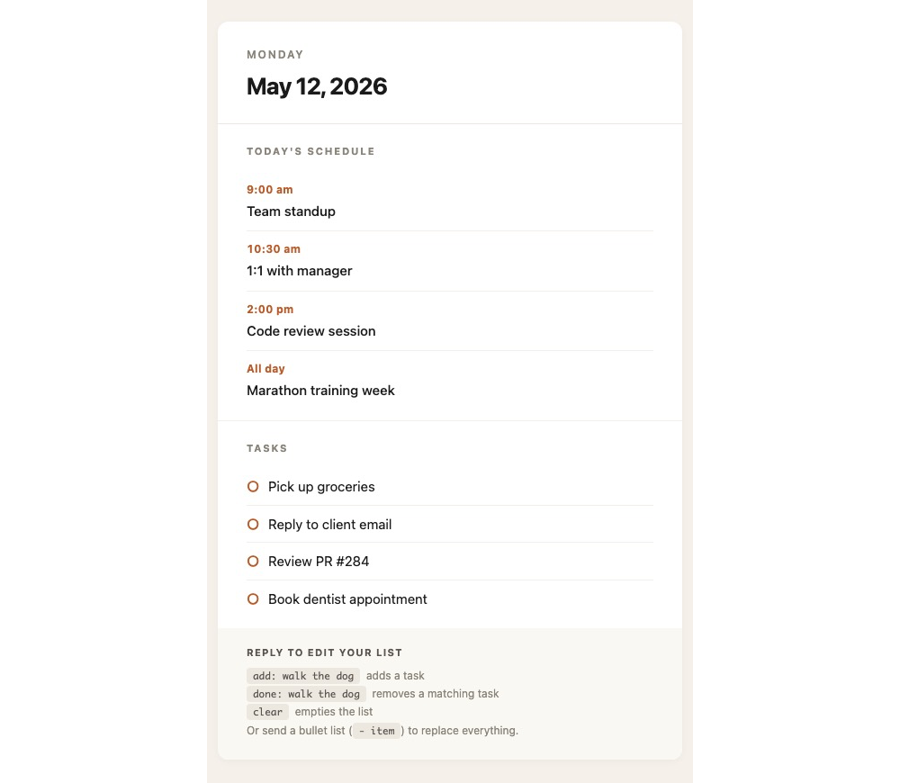
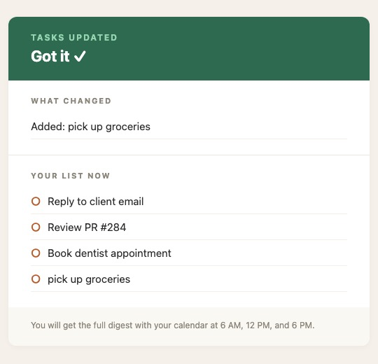
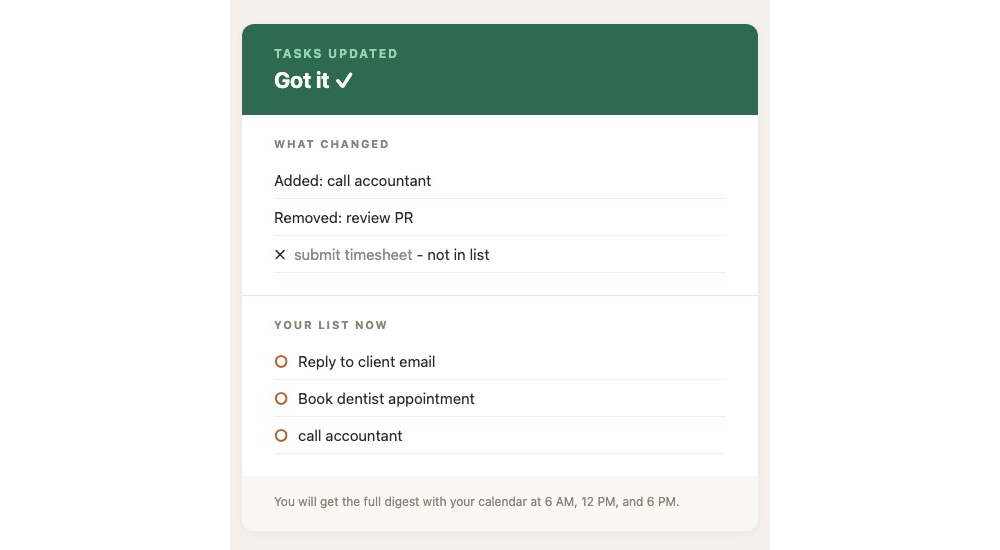
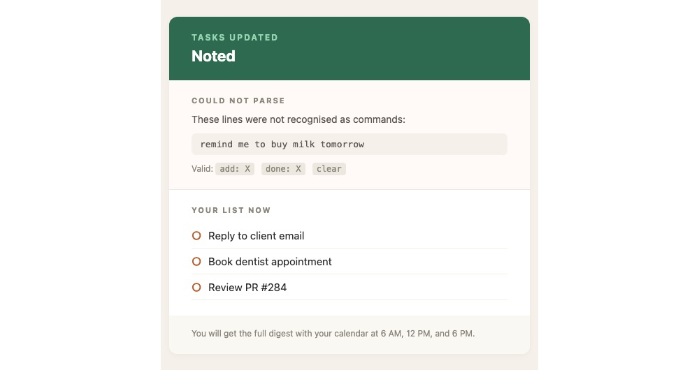

# DailyDigest

A self-hosted daily email assistant. Every morning, afternoon, and evening it sends a digest of the day's calendar events and an editable task list. Tasks are managed entirely over email: send a command, get a reply, the change persists.

The entire system runs on free services and Git: a Python script in GitHub Actions, an HTTP scheduler, a transactional email API, and IMAP.

Oh btw, task.md will be replaced soon by a database.

## Contents

- [Stack](#stack)
- [Prerequisites](#prerequisites)
- [Setup](#setup)
  - [1. Domain and inbound forwarding](#1-domain-and-inbound-forwarding)
  - [2. Outbound email service](#2-outbound-email-service)
  - [3. Gmail App Password](#3-gmail-app-password)
  - [4. Outlook calendar feed](#4-outlook-calendar-feed)
  - [5. Repository and secrets](#5-repository-and-secrets)
  - [6. Gmail filters](#6-gmail-filters)
  - [7. Hourly trigger](#7-hourly-trigger)
- [Usage](#usage)
- [Email examples](#email-examples)
- [Configuration reference](#configuration-reference)
- [Architecture notes](#architecture-notes)
- [Development](#development)
- [Troubleshooting](#troubleshooting)
- [License](#license)

## Stack

| Component          | Service                     | Purpose                                                       |
| ------------------ | --------------------------- | ------------------------------------------------------------- |
| Runtime            | GitHub Actions (Ubuntu)     | Executes the Python script on demand                          |
| Scheduler          | cron-job.org                | Triggers the workflow on the hour, every hour                 |
| Language           | Python 3.12                 | Script logic                                                  |
| Inbound mail       | ImprovMX                    | Forwards `*@yourdomain.tld` to a Gmail inbox                  |
| Outbound mail      | Resend                      | Sends transactional email from your verified domain           |
| Reply storage      | Gmail (IMAP)                | Holds incoming task commands until the script reads them      |
| Calendar source    | Outlook published ICS feed  | Provides today's events without OAuth                         |
| State              | `tasks.md` in this repo     | Single source of truth for the task list, committed by Actions |

All services have free tiers that comfortably cover the load (one HTTP request per hour, a handful of emails per day).

## Prerequisites

Before starting, you will need:

1. A GitHub account.
2. A domain name you control. Any registrar works.
3. A Gmail account. This receives forwarded mail and is the IMAP target.
4. An Outlook account with a calendar you want to read. Personal or work, either is fine.

The setup below walks through every external account creation.

## Setup

### 1. Domain and inbound forwarding

You need any email sent to `morning@yourdomain.tld` to land in your Gmail inbox. ImprovMX does this for free.

1. Sign up at [improvmx.com](https://improvmx.com).
2. Add your domain.
3. In your domain registrar's DNS settings, add the two MX records ImprovMX shows you. Wait for them to verify.
4. Add an alias: `morning@yourdomain.tld` forwards to your Gmail address.

You can stop here, or add more aliases. Every alias forwards to the same Gmail.

### 2. Outbound email service

You need to send email *from* `morning@yourdomain.tld`. ImprovMX does not handle outbound; Resend does.

1. Sign up at [resend.com](https://resend.com).
2. Add your domain.
3. Add the SPF (TXT) and DKIM (CNAME) records Resend shows you. Skip any MX records Resend suggests, since those conflict with ImprovMX.
4. Wait for verification (usually under five minutes).
5. Generate an API key under "API Keys". Save it.

Resend's free tier covers 3,000 emails per month. This system uses roughly 60.

### 3. Gmail App Password

The Python script reads your Gmail over IMAP. Gmail requires an App Password for this, not your regular password.

1. Open [myaccount.google.com](https://myaccount.google.com).
2. Security, then 2-Step Verification. Turn it on if it is not already.
3. Security, then App passwords. Create one named `daily-digest`.
4. Copy the 16-character password. Save it without the spaces.

### 4. Outlook calendar feed

The script reads your calendar by fetching a public ICS URL. No OAuth, no Azure app registration.

1. Open Outlook on the web.
2. Calendar, then Settings (gear icon), then "View all Outlook settings".
3. Calendar, then Shared calendars.
4. Under "Publish a calendar", choose the calendar you want and set permissions to **Can view all details**.
5. Click Publish. Copy the **ICS** URL. (Outlook also shows an HTML URL: do not use that one.)

The published feed refreshes on Outlook's side roughly every few hours. Newly added events may not appear in the digest immediately.

### 5. Repository and secrets

1. Fork or clone this repository to your GitHub account. Keep it private if you prefer.
2. Open Settings, then Secrets and variables, then Actions, then New repository secret. Add the following:

| Secret               | Value                                                                       |
| -------------------- | --------------------------------------------------------------------------- |
| `GMAIL_USER`         | Your Gmail address, e.g. `you@gmail.com`.                                   |
| `GMAIL_APP_PASSWORD` | The 16-character App Password from step 3, no spaces.                       |
| `OWNER_EMAIL`        | Where the digest is delivered. Usually `morning@yourdomain.tld`.            |
| `FROM_EMAIL`         | The address the digest sends from, e.g. `morning@yourdomain.tld`.           |
| `RESEND_API_KEY`     | The API key from step 2.                                                    |
| `ICS_URL`            | The Outlook .ics URL from step 4.                                           |
| `FORWARD_EMAILS`     | Optional. Comma-separated extra BCC recipients. Leave blank to skip.        |

If `OWNER_EMAIL` and `FROM_EMAIL` are both on your domain (recommended), the digest header shows `to: morning@yourdomain.tld` rather than your raw Gmail address.

### 6. Gmail filters

These keep your inbox clean. They are not required for the script to work, but recommended.

1. Gmail, then Settings, then See all settings, then Filters and Blocked Addresses, then Create a new filter.
2. Filter 1, to silence outgoing digest noise:
   - **From:** `morning@yourdomain.tld`
   - Action: Skip Inbox, Mark as read, Apply label `DailyDigest/Updates`, Never mark as important.
3. Filter 2, to silence incoming command emails:
   - **To:** `morning@yourdomain.tld`
   - Action: Skip Inbox, Apply label `DailyDigest/Logs`, Never mark as important.

The script searches `[Gmail]/All Mail`, so archived emails are still found.

### 7. Hourly trigger

GitHub Actions' built-in cron is unreliable. It can run anywhere from 30 minutes to 3 hours late. cron-job.org calls the GitHub API directly and fires on the second.

Full walkthrough is in [docs/cronjob-setup.md](docs/cronjob-setup.md). Brief version:

1. Generate a GitHub fine-grained personal access token with `Actions: Read and write` on this repository.
2. Sign up at [cron-job.org](https://cron-job.org).
3. Create a job:
   - URL: `https://api.github.com/repos/<your-username>/DailyDigest/actions/workflows/daily-email.yml/dispatches`
   - Method: `POST`
   - Body: `{"ref":"main"}`
   - Headers: `Authorization: Bearer <your-PAT>`, `Content-Type: application/json`, `Accept: application/vnd.github.v3+json`
   - Schedule: every hour at `:00`.
4. Click Test run. A successful response is `204 No Content`.

After cron-job.org fires, check your Actions tab. A new run should appear within seconds.

## Usage

Send any email to `morning@yourdomain.tld` from any address. Within an hour, the script processes it and replies.

### Commands

Place one command per line. The script reads every line, so you can batch several edits in one email.

| Command          | Effect                                                                  |
| ---------------- | ----------------------------------------------------------------------- |
| `add: X`         | Appends `X` as a task. Duplicates (case-insensitive) are silently ignored. |
| `done: X`        | Removes the first task whose text contains `X` (case-insensitive).      |
| `remove: X`      | Same as `done: X`.                                                      |
| `clear`          | Empties the list entirely.                                              |
| `- item 1`<br>`- item 2`<br>`- item 3` | If the body is two or more bullet lines, the list is fully replaced. |

If a line does not match any of these patterns, the script replies with a "Could not parse" message and ignores it. If a `done:` target does not match any existing task, the reply notes it as "not in list".

### When emails go out

- **6:00 AM, 12:00 PM, 6:00 PM Pacific:** the full digest with calendar and tasks.
- **Any hour with a processed command:** a confirmation showing what changed plus the digest.
- **Any other hour:** silent (nothing to send).

## Email examples

Screenshots of each email type. The HTML sources are in `docs/html/` if you want to render them yourself. I rendered it here using Chrome directly in `docs/screenshots/` since both imagemagick and wkhtmltopdf failed in my silicon machine for my rendering needs.

```
for file in *.html; do
  name="${file%.html}"
  /Applications/Google\ Chrome.app/Contents/MacOS/Google\ Chrome \
    --headless \
    --disable-gpu \
    --hide-scrollbars \
    --window-size=1440,2000 \
    --screenshot="${name}.png" \
    "file://$(pwd)/$file"
  sips -s format jpeg "${name}.png" --out "${name}.jpg" >/dev/null
  rm "${name}.png"
  echo "Converted $file -> ${name}.jpg"
done
```

### Morning digest

The scheduled email at 6 AM, 12 PM, and 6 PM. Lists today's upcoming events (past events are filtered out) and the current task list.



### Confirmation: single add

After sending `add: pick up groceries`:



### Confirmation: mixed changes

After sending three commands at once, one of which did not match:

```
add: call accountant
done: review PR
done: submit timesheet
```



### Confirmation: unrecognised command

After sending something the parser does not understand:



## Configuration reference

### Environment variables

All variables are passed as GitHub repository secrets and read by `scripts/digest.py`.

| Name                 | Required | Description                                                                  |
| -------------------- | -------- | ---------------------------------------------------------------------------- |
| `GMAIL_USER`         | Yes      | Gmail address used for IMAP login.                                           |
| `GMAIL_APP_PASSWORD` | Yes      | 16-character App Password for the Gmail account.                             |
| `OWNER_EMAIL`        | Yes      | Recipient of every email the script sends.                                   |
| `FROM_EMAIL`         | Yes      | Address the script sends from. Must be on a domain verified in Resend.       |
| `RESEND_API_KEY`     | Yes      | Resend API key with sending permission.                                      |
| `ICS_URL`            | Yes      | Public Outlook ICS URL.                                                      |
| `FORWARD_EMAILS`     | No       | Comma-separated extra BCC recipients on every outgoing email.                |
| `TIMEZONE`           | No       | IANA timezone string. Defaults to `America/Vancouver`.                       |

### Schedule

Defined in `.github/workflows/daily-email.yml`. The workflow has two triggers:

- `repository_dispatch` with type `cron-trigger`: used by cron-job.org.
- `workflow_dispatch`: manual trigger via the Actions UI.

The decision of *what* to send happens inside the Python script, not the workflow. See `main()` in `scripts/digest.py`. To change the digest hours, edit this line:

```python
scheduled = NOW.hour in (6, 12, 18)
```

### Customising the digest email

Edit `templates/email.html`. It is a single HTML file with a `<style>` block. Before sending, `premailer` inlines all CSS so it renders correctly in Gmail, Outlook, Apple Mail, and other clients.

Jinja2 variables available in the template:

| Variable    | Type    | Example                                          |
| ----------- | ------- | ------------------------------------------------ |
| `weekday`   | string  | `Monday`                                         |
| `date_long` | string  | `May 12, 2026`                                   |
| `events`    | list    | `[{"time": "9:00 am", "title": "Standup"}, ...]` |
| `tasks`     | list    | `["Buy milk", "Reply to client"]`                |

## Architecture notes

### Why three external services instead of one?

Each service does one thing well at the free tier:

- **ImprovMX** handles inbound forwarding with MX records. It does not send.
- **Resend** sends transactional email with SPF/DKIM. It does not receive (for free).
- **Gmail** is where you read mail, and IMAP gives the script a way to find replies without setting up a webhook receiver.

You could replace any one of these. The script only depends on Gmail IMAP being reachable and Resend's HTTP API being available.

### IMAP search query

The script searches `[Gmail]/All Mail` with Gmail's native `X-GM-RAW` syntax:

```
deliveredto:morning@yourdomain.tld newer_than:2d
```

`deliveredto:` matches the `Delivered-To` header that ImprovMX adds when forwarding. This works regardless of who sent the original email, so you can email `morning@yourdomain.tld` from any account and the script will find the message.

Already-processed messages are flagged `\Seen` after handling. Future runs skip them.

### Recurring calendar events

`recurring-ical-events` expands ICS `RRULE` patterns into individual occurrences. Without this library, weekly recurring meetings would not appear in the digest because their `DTSTART` is in the past.

Past events (events whose start time is before now) are filtered out so the digest never shows you meetings you have already finished.

### State persistence

`tasks.md` lives in the repo. When the script changes the list, it commits the new file directly back to `main` using the workflow's `GITHUB_TOKEN`. The commit message is `Update tasks via email (YYYY-MM-DD)`. This keeps the task list versioned and inspectable.

## Development

### File structure

```
.
├── .github/
│   └── workflows/
│       ├── daily-email.yml       Main workflow. Triggered hourly.
│       └── cleanup.yml           Deletes daily-email runs older than 2 days. Daily.
├── docs/
│   ├── cronjob-setup.md          cron-job.org configuration walkthrough.
│   └── screenshots/              HTML sources for the email examples in this README.
├── scripts/
│   └── digest.py                 Main script. All logic.
├── templates/
│   └── email.html                Jinja2 template for the morning digest.
├── tasks.md                      The task list. Committed by the workflow.
├── requirements.txt              Python dependencies.
├── LICENSE
└── README.md
```

### Local testing

To run the script locally:

```bash
git clone https://github.com/<your-username>/DailyDigest.git
cd DailyDigest
python -m venv .venv
source .venv/bin/activate
pip install -r requirements.txt
```

Create a `.env` file (it is in `.gitignore`) with the same variables you set as GitHub secrets, then:

```bash
set -a; source .env; set +a
python scripts/digest.py
```

The script logs every step to stdout with timestamps. Output for a run that finds no commands and is not on a scheduled hour looks like:

```
[14:00:01] === Daily Digest starting ===
[14:00:01] Local time: 2026-05-12 14:00 PDT
[14:00:01] Connecting to IMAP as you@gmail.com
[14:00:02] All Mail select: OK
[14:00:02] IMAP search: X-GM-RAW "deliveredto:morning@arfaz.ca newer_than:2d"
[14:00:03] Found 0 message(s) delivered to morning@arfaz.ca
[14:00:03] Read 3 task(s): ['Buy milk', 'Reply to client', 'Review PR #284']
[14:00:03] Hour 14 - skipping digest
[14:00:03] === Done ===
```

### Modifying behaviour

Common changes and where to make them:

| Goal                              | File                              | Function or location              |
| --------------------------------- | --------------------------------- | --------------------------------- |
| Change digest send times          | `scripts/digest.py`               | `main()`, the `scheduled` line    |
| Add a new command (e.g. priority) | `scripts/digest.py`               | `parse_commands()`                |
| Change the visual style           | `templates/email.html`            | The `<style>` block               |
| Change the confirmation styling   | `scripts/digest.py`               | `send_reply_summary()`            |
| Change the IMAP search window     | `scripts/digest.py`               | `process_inbox()`, `newer_than`   |

## Troubleshooting

**Workflow runs but no email arrives.** Check the Actions run log. Common causes: invalid Gmail App Password (must be 16 characters with no spaces), Resend API key revoked, `FROM_EMAIL` not on a verified Resend domain.

**Task command not picked up.** Verify the email landed in Gmail by checking `[Gmail]/All Mail` for the address `morning@yourdomain.tld`. If it is there, check the run log for the IMAP search output. If the search returned 0 messages, the `Delivered-To` header may not match `FROM_EMAIL`.

**cron-job.org returns 404.** The PAT does not have access to the repository, or the URL is wrong. Confirm the token has `Actions: Read and write` on the specific repo and the URL spells the repo name correctly.

**cron-job.org returns 401.** The `Authorization` header is malformed. The value must be exactly `Bearer <token>` with a space after `Bearer`.

**Calendar empty when it should not be.** Outlook publishes the ICS feed on its own schedule (every few hours). Newly added events may not appear until Outlook refreshes the feed. Also verify the ICS URL works in a browser.

**Workflow run history fills up.** The `cleanup.yml` workflow runs daily and deletes `daily-email.yml` runs older than 2 days. If it stops working, check the Actions tab for failed cleanup runs.

## License

Apache License with attribution. See [LICENSE](LICENSE). You can use this code in personal or commercial projects, modify it, and redistribute it.
